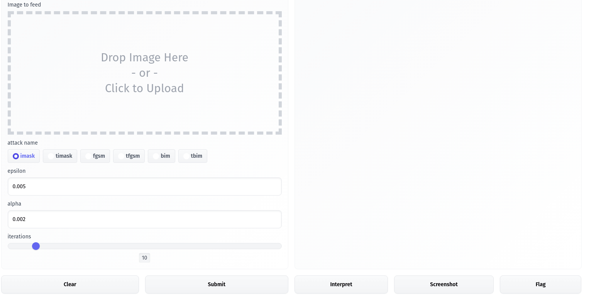

[![Contributors][contributors-shield]][contributors-url]
[![Forks][forks-shield]][forks-url]
[![Stargazers][stars-shield]][stars-url]
[![Issues][issues-shield]][issues-url]
[![MIT License][license-shield]][license-url]
[![LinkedIn][linkedin-shield]][linkedin-url]

 

  

  <h3 align="center">OpenAdv</h3>

  

    An easy to use simple adversarial attack tool
     
    <a href="https://github.com/Thytu/OpenAdv"><strong>Explore the docs »</strong></a>
     
     
    <a href="https://github.com/Thytu/OpenAdv">View Demo</a>
    ·
    <a href="https://github.com/Thytu/OpenAdv/issues">Report Bug</a>
    ·
    <a href="https://github.com/Thytu/OpenAdv/issues">Request Feature</a>
  

 

<!-- TABLE OF CONTENTS -->

  
Table of Contents

  <ol>
    <li><a href="#about-the-project">About The Project</a></li>
    <li><a href="#getting-started">Getting Started</a></li>
    <li><a href="#usage">Usage</a></li>
    <li><a href="#roadmap">Roadmap</a></li>
    <li><a href="#contributing">Contributing</a></li>
    <li><a href="#license">License</a></li>
    <li><a href="#contact">Contact</a></li>
    <li><a href="#acknowledgments">Acknowledgments</a></li>
  </ol>

 

## About The Project

There are many great web interface to try adversarial attacks available on GitHub; however, I didn't find one that really suited my needs so I created this one.

Key features:
* Simple examples to get started
* Multiple type of Adv Attacks available
* Usage of custom model (vision only) (in progress)

If you miss any type of Adv Attack please consider to fork this repo and to create a pull request or to open an issue.

 

  

(<a href="#top">back to top</a>)

### Built With

* [PyTorch](https://pytorch.org)
* [Gradio](https://pytorch.org)

(<a href="#top">back to top</a>)

<!-- GETTING STARTED -->
## Getting Started

To get a local copy up and running follow these simple example steps.

Make sure to use python3.9.X, torch is currently not supported for python 3.10 and native tuple type hinting has been introduced since python3.9.

Then you only need **to install the python dependencies** : `python3 -m pip install requirements.txt`

**To start the server** : `python src/main`

(<a href="#top">back to top</a>)

<!-- USAGE EXAMPLES -->
## Usage

To start you simply have to select the attack you want to proceed among : FGSM, TFGSM, BIM and TBIM

Then select or drag & drop the image on which you want to apply the attack and select the parameters for the attack.

TODO: describe every param
`epsilon` :  todo
`alpha` :  todo
`iterations` :  todo

### FGSM
One-step gradient-based method.
Do not use `alpha`, `target` and `iterations`.

### TFGSM
FGSM algorithm with target label.
Do not use `alpha` and `iterations`.

### BIM
Iterative FGSM algorithm.
Do not use `target`.

### TBIM
BIM algorithm with target label.

(<a href="#top">back to top</a>)

## Roadmap

- [ ] Support more attacks
    - [ ] Carlini & Wagner
    - [ ] Deepfool
    - [ ] Limited-memory Broyden-Fletcher-Goldfarb-Shanno
    - [ ] Jacobian-based Saliency Map
- [ ] Add Changelog
- [ ] Custom Model Support

See the [open issues](https://github.com/Thytu/OpenAdv/issues) for a full list of proposed features and known issues.

(<a href="#top">back to top</a>)

## Contributing

Contributions are what make the open source community such an amazing place to learn, inspire, and create. Any contributions you make are **greatly appreciated**.

If you have a suggestion that would make this better, please fork the repo and create a pull request. You can also simply open an issue with the tag "enhancement".
Don't forget to give the project a star! Thanks again!

1. Fork the Project
2. Create your Feature Branch (`git checkout -b feature/my-feature`)
3. Commit your Changes (`git commit -m 'feat: my new feature`)
4. Push to the Branch (`git push origin feature/my-feature`)
5. Open a Pull Request

Please try to follow [Conventional Commits](https://www.conventionalcommits.org/en/v1.0.0/).

(<a href="#top">back to top</a>)

## License

Distributed under the MIT License. See `LICENSE.txt` for more information.

(<a href="#top">back to top</a>)

## Contact

Valentin De Matos - [@ThytuVDM](https://twitter.com/ThytuVDM) - valentin.de-matos@epitech.eu

Project Link: [https://github.com/Thytu/OpenAdv](https://github.com/Thytu/OpenAdv)

(<a href="#top">back to top</a>)

## Acknowledgments

* [Adversarial Attacks in Machine Learning and How to Defend Against Them](https://towardsdatascience.com/OpenAdv-in-machine-learning-and-how-to-defend-against-them-a2beed95f49c)
* [What Is Adversarial Machine Learning? Attack Methods in 2021](https://viso.ai/deep-learning/adversarial-machine-learning/)
* [Advances in adversarial attacks and defenses in computer vision: A survey](https://arxiv.org/pdf/2108.00401.pdf)
* [Pytorch - ADVERSARIAL EXAMPLE GENERATION](https://pytorch.org/tutorials/beginner/fgsm_tutorial.html)
* [README Template](https://github.com/othneildrew/Best-README-Template)

(<a href="#top">back to top</a>)

<!-- MARKDOWN LINKS & IMAGES -->
[contributors-shield]: https://img.shields.io/github/contributors/Thytu/OpenAdv.svg?style=for-the-badge
[contributors-url]: https://github.com/Thytu/OpenAdv/graphs/contributors
[issues]: https://img.shields.io/github/issues/Thytu/OpenAdv
[forks-shield]: https://img.shields.io/github/forks/Thytu/OpenAdv.svg?style=for-the-badge
[forks-url]: https://github.com/Thytu/OpenAdv/network/members
[stars-shield]: https://img.shields.io/github/stars/Thytu/OpenAdv.svg?style=for-the-badge
[stars-url]: https://github.com/Thytu/OpenAdv/stargazers
[issues-shield]: https://img.shields.io/github/issues/Thytu/OpenAdv.svg?style=for-the-badge
[issues-url]: https://github.com/Thytu/OpenAdv/issues
[license-shield]: https://img.shields.io/github/license/Thytu/OpenAdv.svg?style=for-the-badge
[license-url]: https://github.com/Thytu/OpenAdv/blob/master/LICENSE.txt
[linkedin-shield]: https://img.shields.io/badge/-LinkedIn-black.svg?style=for-the-badge&logo=linkedin&colorB=555
[linkedin-url]: https://linkedin.com/in/valentin-de-matos
[product-screenshot]: .img/demo-simple.gif
